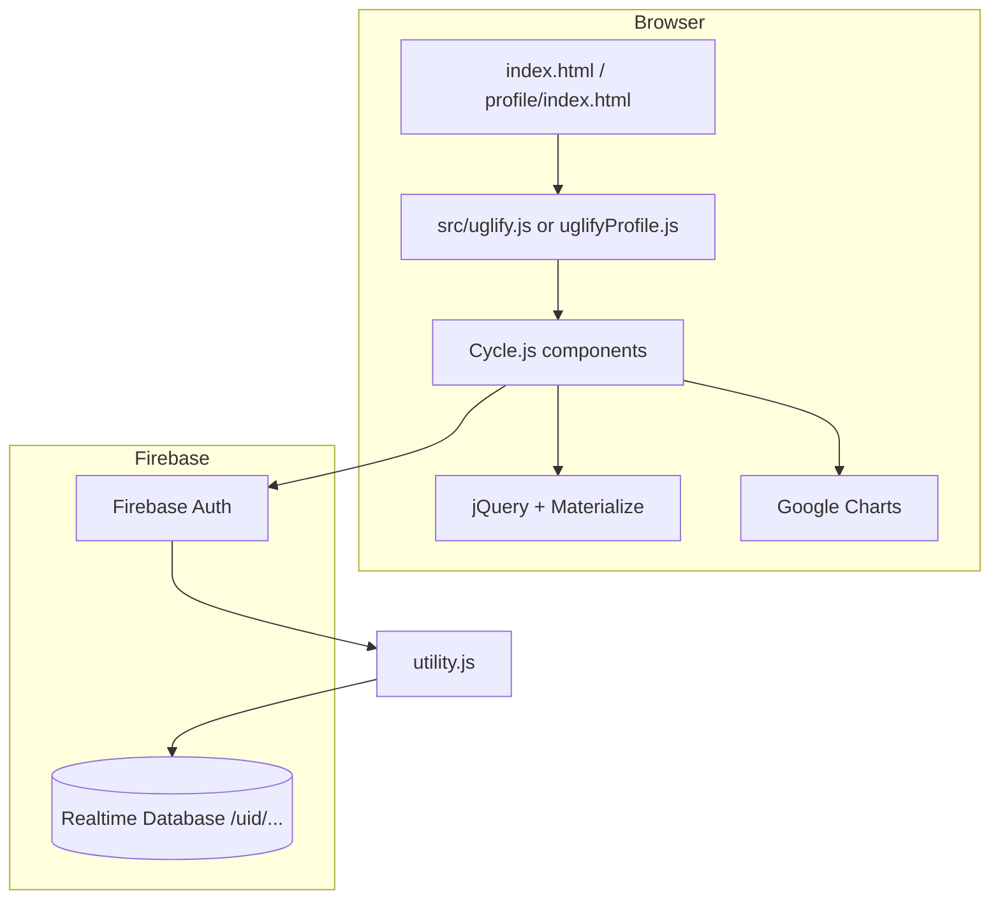

# Net-Worth Repository Guide

Reference document for understanding and working on this codebase in future sessions.

## Overview

**Net-Worth** (branded in the UI as **Worth Watchers**) is a personal finance web app for tracking monthly **assets**, **debts**, and **net worth** over time. Users sign in with Firebase, enter line items per month, and view summaries and charts.

| Item | Detail |
|------|--------|
| **Repository** | [github.com/trevordowdle/Net-Worth](https://github.com/trevordowdle/Net-Worth) |
| **Public deployment** | [trevordowdle.github.io/Net-Worth/](https://trevordowdle.github.io/Net-Worth/) (GitHub Pages) |
| **License** | ISC (`package.json`); terms page also references MIT for software |
| **Runtime** | Static frontend + Firebase backend; optional local Node static server |

There is no backend API in this repo—all persistence goes through **Firebase Realtime Database** and **Firebase Authentication**.

---

## Technology Stack

| Layer | Technology | Notes |
|-------|------------|--------|
| UI framework | [Cycle.js](https://cycle.js.org/) v6 + [@cycle/isolate](https://github.com/cyclejs/cyclejs/tree/master/isolate) | Functional reactive UI; `Cycle.run`, virtual DOM via `CycleDOM` |
| Reactive streams | RxJS v4 | `Rx.Observable`, event streams from DOM |
| DOM helpers | jQuery 1.12 | Materialize plugins, imperative DOM updates alongside Cycle |
| CSS / components | Materialize CSS 0.97.7 | Layout, modals, side nav, carousel, toasts |
| Auth | Firebase JS 3.5 + Firebase UI 0.5 | Google + email sign-in; popup flow on login |
| Database | Firebase Realtime Database | Per-user tree at `/{uid}/` |
| Charts | Google Charts | Line charts (net worth trend); pie charts on profile |
| Build | Gulp 4 | Concat → Babel (`@babel/preset-env`) → uglify into `src/` |
| Local server | `server.js` | Plain `http` static file server on port **3000** |

Dependencies are only in `devDependencies` (Gulp toolchain). The app loads libraries from CDNs in HTML—no bundler for vendor code.

---

## Repository Layout

```
Net-Worth/
├── index.html              # Main app entry (loads src/uglify.js)
├── terms.html              # Terms of service / privacy (static)
├── server.js               # Local static file server (:3000)
├── package.json
├── gulpfile.js             # Build: concat + babel + uglify
│
├── js/                     # Source modules (edit these)
│   ├── main.js             # App bootstrap, page layout, auth gate
│   ├── login.js            # Login screen + Firebase UI
│   ├── utility.js          # Firebase init, data model, CRUD helpers
│   ├── sidebar.js          # Side nav, lists, chart population
│   ├── modal.js            # Add / edit / remove entry modals
│   ├── carousel.js         # Month carousel in header
│   └── plugins.js          # Large file: Waves + Materialize-related code
│
├── src/                    # Build output (committed; regenerate with Gulp)
│   ├── concat.js           # Unminified main bundle
│   ├── uglify.js           # Production bundle for index.html
│   ├── concatProfile.js
│   └── uglifyProfile.js    # Production bundle for profile
│
├── css/
│   ├── main.css            # App layout, carousel, charts, side nav
│   └── login.css           # Login page styling
│
├── profile/                # Secondary “profile” view
│   ├── index.html
│   ├── js/main.js          # Profile-specific Cycle app + charts
│   └── css/main.css
│
└── docs/
    └── REPOSITORY.md       # This file
```

**Not in repo (expected at runtime):** `img/` (e.g. `logo2.png`, `anony.jpg`) referenced by HTML/JS; `404.html` referenced by `server.js` on missing files.

`package.json` declares `"directories": { "doc": "docs" }` for documentation.

---

## Application Surfaces

### 1. Main app (`index.html`)

**Authenticated flow:**

1. `utility.js` initializes Firebase and Google Charts on load.
2. `main.js` `initApp()` listens to `firebase.auth().onAuthStateChanged`.
3. If signed in: `utility.setDatabase(user.uid)`, then `Cycle.run(page, drivers)`.
4. If signed out: `Cycle.run(loginModule, drivers)` unless `?user=test` triggers a dev auto-login (see **Caveats**).

**UI composition (`page`):**

- `headerModule` — carousel (month picker), `sideNavModule`, two `modalModule` instances (add + edit).
- `mainModule` — net worth summary row, line chart (`#curve_chart`), placeholder columns for asset/debt charts.

**Side nav:** collapsible Assets / Debts lists; floating “+” opens add modal; profile image links to `profile/`.

### 2. Profile (`profile/index.html`)

Shareable/historical view for a user:

- Loads `../src/uglifyProfile.js` (built from `js/utility.js` + `profile/js/main.js`).
- Auth: requires `?user={uid}` in URL **or** signed-in user (then URL is updated via `history.replaceState`).
- Month navigation (arrows), toggle **Net Worth / Assets / Debts** (applies to main line chart, pies, and comparison chart).
- **Tag filter bar** (when any tags exist): multi-select chips (AND), filtered totals, matching-entry list, **Add line** for saved comparison series.
- **Comparison chart**: multi-line Google Chart for up to 5 saved tag series; zoomed to months where at least one series has matches.
- Asset/debt pie charts and main line chart respect the active tag filter when tags are selected.
- Header: overlapping profile photo + display name; `utility.applyProfilePhoto()` resolves URLs for GitHub Pages paths and Google avatars.
- Viewing another user’s profile (`?user=` without matching login) sets `utility.profileEdit = false` (read-only; no name edit, logout hidden, no add/remove series or flip-sign).
- **Note:** Profile HTML does not load Materialize JS; feedback uses `profileToast()` (`alert` fallback), not `Materialize.toast`.

### 3. Login (`login.js`)

Green full-page login; Firebase UI in `#firebaseui-auth-container`. Providers: Google, email. Terms link to `terms.html`.

---

## Architecture



**Pattern:** Cycle components render virtual DOM and wire DOM events to Rx streams. **Data sync** is largely imperative: `utility.watchData` / `watchDataProfile` subscribe to Firebase `on("value")`, then jQuery/DOM functions (`populateNetWorthValues`, `drawLineGraph`, etc.) update the page.

**Global state:** `userData` and `userDatabase` are module-level variables in `utility.js` (and used across concatenated files).

---

## Firebase Data Model

Each user’s data lives at:

```
/{firebaseAuthUid}/
  displayName: string (optional)
  photoURL: string (optional)     # often synced from Firebase Auth on main app login
  entries/
    {YYYYMM}/          # e.g. "201612" = December 2016
      Asset/
        {name}: number
      Debt/
        {name}: number
      NetWorth: number | null    # computed on write
      Assets: number | null
      Debts: number | null
      tags/                      # parallel to Asset/Debt (Phase 1)
        Asset/
          {name}: string[]       # e.g. ["stock", "non-retirement"]
        Debt/
          {name}: string[]
  tagSeries/                     # saved comparison lines (Phase 3)
    {pushId}/
      label: string
      tags: string[]
      negate: boolean             # when true, series value is multiplied by -1 (flip sign)
      match: "any" | "all"        # optional; any = OR, all = AND (omitted on old lines → AND)
```

**Month key format:** `utility.getReferenceStr(month, year)` → `year + zeroPaddedMonth` (e.g. `2016` + `12` → `"201612"`).

**Writes:** `utility.updateData(entry)` merges asset/debt line items, optional `entry.tags`, recomputes totals via `getNetWorth()`, and `userDatabase.update(updateObj)` with paths like `entries/201612/Asset/Savings` and `entries/201612/tags/Asset/Savings`.

**Reads:** `watchData` keeps `userData.entries` in sync; `watchDataProfile` also loads `tagSeries`. `getDataObj()` picks the current carousel month, falls back to previous month if current has no `NetWorth` (shown greyed via `entryGrey`).

**Tag normalization:** `utility.normalizeTags()` — lowercase, trim, dedupe; comma-separated input in modals.

**Filter semantics (profile):** Default **OR** (`any`) — entry matches if it has **any** selected tag. Toggle **All tags** (`all`) for **AND** (must have every selected tag). Comparison series store their own `match` field (`any` | `all`); lines saved before this field default to **all** (AND).

Firebase config (including `apiKey`) is in `js/utility.js`—standard for client Firebase apps; security rules are not in this repo.

---

## Tags and profile analysis (Phases 1–3)

Feature plan was split into four phases; **Phases 1–3 are implemented** and match current personal use. Phase 4 is optional polish only (see below).

### Phase 1 — Dashboard tags (foundation)

| Area | Behavior |
|------|----------|
| **Add/Edit modal** | Comma-separated tags field; saved on `updateData` |
| **Sidebar rows** | Tag chips under each entry (`utility.entryRowHtml`, `formatTagsHtml`) |
| **Grey month** | If current month has no data, previous month’s values/tags display grey; first save copies tags into current month (same as values) |
| **Remove entry** | Clears value and `tags/{type}/{name}` |

**Key APIs:** `getTagsForEntry`, `getTagsForDisplay`, `syncEntryTagsLocal`, `tagsToInputValue`.

### Phase 2 — Profile tag filter

| Area | Behavior |
|------|----------|
| **Filter bar** | All tags ever used (`getAllTags`); click chips to toggle; **Any tag** / **All tags** match mode (default **Any**); **Clear** resets tags only |
| **Totals** | Assets / Debts / Net Worth summary row uses `sumTaggedEntries` when filter active |
| **Main line chart** | `getFilteredLineValue` per month through selected end month |
| **Pie charts** | Only matching entries |
| **Matching list** | Shows entries included for the navigated month |

Session filter state: `userData.profileTagFilter` (not persisted to Firebase).

### Phase 3 — Comparison lines (multi-series chart)

| Area | Behavior |
|------|----------|
| **Add line** | Select tags in filter bar → optional “Flip sign” checkbox → **Add line** (auto-label from tags if no custom name); clears filter for next line |
| **Limit** | Up to **5** series; duplicate tag sets rejected (`findTagSeriesByTags`) |
| **Persist** | `tagSeries/{id}` in Firebase |
| **Chart** | `buildSeriesChartRows` / `drawTagSeriesChart`; **Net Worth / Assets / Debts** tabs apply to each series via `getSeriesLineValue` |
| **Date range** | `getSeriesChartMonthKeys` — only months where at least one series has tagged matches (no flat zero stretch across full history) |
| **Flip sign** | `negate: true` → `val = -val` (true sign flip, not `-Math.abs`) |
| **Edit mode** | **Flip sign** / **Remove** on each line when `utility.profileEdit` is true |

**Key APIs:** `getTagSeriesList`, `saveTagSeries`, `setTagSeriesNegate`, `removeTagSeries`, `monthHasTaggedSeriesData`.

**UI files:** `profile/js/main.js` (filter bar, series list, chart row), `profile/css/main.css` (`.tag-filter-*`, `.tag-series-*`).

### Path helpers (local vs GitHub Pages)

| Function | Purpose |
|----------|---------|
| `getAppBasePath()` | Strips `/profile` from pathname; returns `''` or `/Net-Worth` |
| `appUrl(suffix)` | Directory URLs with trailing slash (e.g. `profile/`) |
| `assetUrl(suffix)` | Static files without trailing slash (e.g. `img/anony.jpg`) |
| `resolvePhotoURL` / `applyProfilePhoto` | Profile avatar: DB URL, Auth fallback, relative path fix, `referrerpolicy="no-referrer"` |

---

## Phase 4 — optional polish (future reference)

Not required for core tagging workflows. Consider only if a specific pain point appears.

| Idea | Description | Notes |
|------|-------------|--------|
| **Tag autocomplete** | Suggest existing tags while typing in dashboard modal | `getAllTags()` already scans history; wire to modal input |
| **Rename / tag merge** | Fix typos or merge `stock` + `stocks` across entries | Tags keyed by entry **name** today; rename = new key (same as values) |
| ~~**OR filter mode**~~ | Implemented: profile default **any**; per-series `match` in Firebase | Toggle on filter bar; old series without `match` behave as **all** |
| **Export / share** | Export comparison CSV or `profile/?user=&tags=` deep link | Read-only share already via `?user=`; tag filter is session-only today |
| **Materialize on profile** | Load Materialize JS on profile for toasts | Currently `profileToast()` → `alert` |
| **Firebase rules docs** | Document or tighten rules for `tags` arrays and `tagSeries` | Rules not versioned in repo |
| **Series label edit** | Rename saved comparison lines without re-adding | Would need `updateTagSeries` helper |
| **Per-series graph mode** | e.g. one line assets-only, another debts-only | Today one global Net Worth / Assets / Debts toggle for all series |

**Original build order (completed through Phase 3):** dashboard tags → profile filter → comparison chart + persistence.

---

## Key Modules (where to change what)

| File | Responsibility |
|------|----------------|
| `js/utility.js` | Firebase init, `setDatabase`, `updateData`, tags CRUD/normalize, `sumTaggedEntries`, `tagSeries` CRUD, chart row builders, `appUrl`/`assetUrl`, profile photo helpers, month averages (1/3/6 mo) |
| `js/main.js` | Auth routing, `page` / `headerModule` / `mainModule`, email verification on first login |
| `js/login.js` | Firebase UI config, login layout |
| `js/sidebar.js` | Side nav VTree, `populateNetWorthValues`, `drawLineGraph`, `drawGraph` (pie, main app) |
| `js/modal.js` | Add/update/remove handlers (`addClick`, `updateClick`, `removeClick`), validation toasts |
| `js/carousel.js` | Materialize carousel for month selection; updates `userData.currentMonth` / `currentYear` |
| `js/plugins.js` | Third-party UI behavior (very large); avoid editing unless necessary |
| `profile/js/main.js` | Profile layout, tag filter bar, comparison series UI/chart, `populateNetWorthGraph`, profile line/pie charts, profile auth URL handling |

**Edit workflow:** change files under `js/` (and `profile/js/`), run Gulp, commit updated `src/uglify*.js` if that is the project convention (built artifacts are present in the repo).

---

## Build and Run

### Install (Gulp toolchain)

```bash
npm install
```

The repo includes `.npmrc` with `cache=.npm-cache` so installs use a **project-local npm cache**. Use this if you see `EACCES` / `EEXIST` errors under `~/.npm/_cacache` (often from an old `sudo npm` run). To repair the global cache instead: `sudo chown -R $(whoami) ~/.npm`.

### Build bundles

```bash
npm run build
# equivalent: npx gulp
```

| Gulp task | Input | Output |
|-----------|--------|--------|
| Default (main) | `js/*.js` (alphabetical glob order) | `src/concat.js`, `src/uglify.js` |
| Profile | `js/utility.js` + `profile/js/main.js` | `src/concatProfile.js`, `src/uglifyProfile.js` |

Concat order for main bundle (glob): `carousel.js`, `login.js`, `main.js`, `modal.js`, `plugins.js`, `sidebar.js`, `utility.js`.

### Local development server

```bash
npm start
# Serves at http://localhost:3000/
```

`server.js` maps `/` and `/Net-Worth` → `index.html`, `/Net-Worth/profile` → `profile/index.html`. Paths assume deployment under a `/Net-Worth` base on GitHub Pages.

### Tests

`npm test` is a placeholder (exits with error). No automated test suite in the repo.

---

## User Flows (quick reference)

| Flow | Entry | Behavior |
|------|--------|----------|
| Sign in | `/` or `/Net-Worth` | Firebase UI → main dashboard |
| Add entry | Side nav “+” | Modal → `utility.updateData` → Firebase + UI refresh |
| Edit entry | Hover edit icon on line item | `#modal2` → update |
| Remove entry | Edit modal “REMOVE” | Sets value `null`, removes DOM node |
| Change month | Header carousel arrows | Updates current month, reloads data/charts |
| View profile | Side nav profile image | `profile/` with own uid |
| Share profile | `profile/?user={uid}` | Read-only view of that user’s history |
| Tag an entry | Add/Edit modal | Comma-separated tags → `entries/{month}/tags/...` |
| Filter profile by tags | Profile tag chips | AND filter on totals, pies, main chart |
| Compare tag groups | Profile **Add line** | Up to 5 saved series in `tagSeries/`, multi-line chart |
| Flip sign on series | **Flip sign** on comparison line | Toggles `negate` in Firebase |

---

## Deployment

- **GitHub Pages** at `https://trevordowdle.github.io/Net-Worth/` (see `terms.html`).
- Static assets only; Firebase project `networth-8b077` (see `utility.js`).
- HTML references built files `src/uglify.js` and `src/uglifyProfile.js`, not raw `js/` sources.

---

## Caveats and Technical Debt

1. **Legacy stack** — Firebase 3.x, Cycle.js 6, RxJS 4, Materialize 0.97, jQuery 1.12. Upgrades would be a large migration.
2. **Built artifacts in git** — Production loads `src/uglify*.js`; remember to rebuild after editing `js/`.
3. **Dev test login** — `?user=test` on the main app auto-signs in with hardcoded `test@test.com` / `joejoe` in `main.js`. Remove or guard before any public fork.
4. **Mixed paradigms** — Cycle for structure, jQuery for Materialize and many updates. New features should follow existing patterns in the same file/module.
5. **Missing assets** — `img/` may be gitignored locally; app expects `img/logo2.png`, `img/anony.jpg`. Use `assetUrl()` for correct paths from `/profile/`.
6. **Security rules** — Firebase database rules are not versioned here; behavior depends on Firebase console configuration. Tag arrays and `tagSeries` are client-written like other user data.
7. **Profile `/profile` URL** — `profile/index.html` redirects to trailing slash; `server.js` does the same locally so `css/main.css` resolves.

---

## Common Tasks for Future Sessions

| Task | Where to look |
|------|----------------|
| Change auth providers | `js/login.js` → `uiConfig.signInOptions` |
| Change data shape / calculations | `js/utility.js` → `updateData`, `getNetWorth`, `getDataObj` |
| Change main dashboard layout | `js/main.js`, `js/sidebar.js`, `css/main.css` |
| Change profile charts | `profile/js/main.js` → `drawLineGraph`, `drawPieGraphs`, `drawTagSeriesChart` |
| Change tag / filter behavior | `js/utility.js` → `normalizeTags`, `sumTaggedEntries`, `getTagSeriesList`, `updateData` |
| Change comparison series UX | `profile/js/main.js` → `addTagSeriesFromFilter`, `renderTagSeriesList`, `refreshProfileView` |
| Change tag chips on dashboard | `js/sidebar.js` → `entryRowHtml`; `js/modal.js` for input |
| Fix modal validation | `js/modal.js` → `toastMap`, `addClick` |
| Update dependencies / CDN URLs | `index.html`, `profile/index.html` |
| Fix local routing | `server.js` path mappings |

---

## File → Concern Index

```
Auth gate .............. main.js, profile/js/main.js
Firebase config ........ utility.js
CRUD / totals .......... utility.js, modal.js
Lists & sidebar ........ sidebar.js
Month picker ........... carousel.js
Login UI ............... login.js
Profile-only UI ........ profile/js/main.js
Tags / series logic .... utility.js (shared by main + profile bundles)
Tag filter / chart UI .. profile/js/main.js, profile/css/main.css
Styles ................. css/main.css, css/login.css, profile/css/main.css
Build .................. gulpfile.js → src/
Local server ........... server.js
Legal .................. terms.html
```

---

*Last updated: May 2026 (tags Phases 1–3, profile analysis, comparison chart).*
